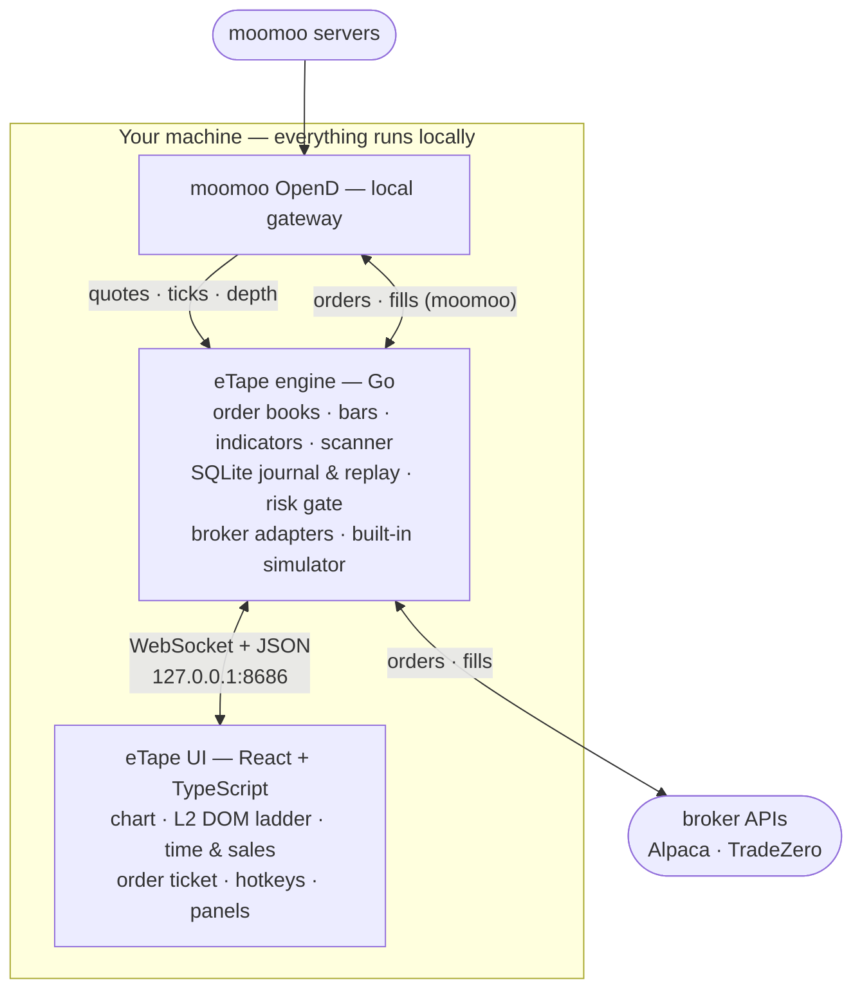

<div align="center">


# eTape

**A free, open-source day-trading platform — read the tape, work the ladder, fire orders from hotkeys.**

Real-time charts · Level 2 DOM ladder · Time & Sales · Pre-market scanner · Multi-broker execution


[](LICENSE)
[](https://github.com/earlisreal/eTape/releases/latest)

<!-- SCREENSHOT: drag your screenshot into the GitHub README editor (or any issue
     comment) to upload it, then replace the URL below with the generated
     https://github.com/user-attachments/assets/... link. -->


</div>

---

eTape is a trading platform built the way scalpers and momentum day traders actually work:
one screen with fast charts, a live order book, the tape, and one-keystroke order entry —
running **entirely on your own machine**. No subscription, no cloud middleman, no
per-month platform fee. Bring a [moomoo](https://www.moomoo.com/) account for market data
and the broker of your choice for execution, and everything else is free and open source.

## Why eTape?

- **Speed as a design rule.** The engine is pure Go; the chart, ladder, and tape are
  canvas surfaces painted imperatively and coalesced to one repaint per frame.
  High-frequency market data never touches React state.
- **10-second candles, built live from raw ticks.** Sub-minute momentum most retail
  platforms simply can't show — bucketed by exchange timestamp with live buy/sell
  direction, straight off the tick feed.
- **A real Level 2 DOM ladder.** Full-depth order book rendered on canvas, fed by
  moomoo's tick-and-depth feed — not a 1-level quote widget.
- **A clearly labelled local LULD aid.** During regular hours, supported symbols
  may show an `EST LULD` approximation built from the local eligible-print feed.
  It is never an official band, halt signal, order control, or risk control;
  unsupported/expired symbols remain unavailable.
- **Broker-agnostic execution.** The same order ticket, hotkeys, and risk gates drive
  TradeZero, Alpaca, or the built-in simulator. Fills come back as generic events and
  land on your chart as markers in real time, whatever the venue.
- **Ticketless hotkeys.** The order ticket is optional: hotkeys use the most recently
  user-activated grouped Dockview panel across open windows. The target is ephemeral,
  never saved in a workspace or restored across a full restart, and its read-only cue
  shows the linked symbol and resolved venue.
- **Safety-gated by default.** Zero venues are configured out of the box. Every order
  must pass a two-layer risk gate (global caps + per-venue caps: max day loss, order
  value, position size, open orders), and each venue has an explicit arm/disarm switch.
- **A live demo that actually feels live.** No account, no setup: a synthetic market
  with a warm year of history, a breathing DOM, and a moving scanner board,
  streaming indefinitely — not a 20-minute canned replay. The universe (which
  symbols run, which gap, which crash) reshuffles every launch, so spotting the
  mover is part of the practice, not something you memorize.
- **Every session recorded.** An always-on SQLite journal captures the full feed —
  quotes, ticks, books, bars — so any day can be replayed through the same engine
  (the E2E suite runs on this too).
- **Local-first and private.** The explicit user profile stores config, credentials,
  and the journal in `~/.eTape/` on your disk. Development, demo, replay, and tests
  use isolated roots by default. The UI is served from `127.0.0.1`.

## Features

**Charting**
- TradingView [Lightweight Charts](https://github.com/tradingview/lightweight-charts)
  candlesticks, from 10-second bars up to daily/weekly/monthly
- Indicators: VWAP, EMA, SMA, MACD, Volume
- Drawing tools — horizontal line, trend line, extended line, rectangle — with
  per-tool color/width/style memory
- Live fill markers (buy/sell diamonds) and fill sounds
- Extended-hours (pre-market / after-hours) data support

**Order flow**
- Level 2 DOM ladder with full order-book depth
- Time & Sales tape with buy/sell coloring, virtualized over a ring buffer

**Scanning & context**
- Pre-market gap scanner with float, volume, Volume Ratio, and %-change filters, plus Reported Short Interest context
- Session-aware scanner (gainers, losers, and most active)
- Stock Info panel: fundamentals grid plus a live news feed with publish times and
  type badges

**Execution**
- Order ticket with market / limit / stop / stop-limit
- Hotkey deck: configurable one-keystroke order templates with price offsets and
  position sizing by buying-power % or position %
- Account, positions, open/closed orders, and trade-history panels
- Built-in **paper simulator with realistic fills**: orders walk the live book,
  partial fills, resting limit orders, configurable slippage and fill latency

**Workspace**
- Dockable, drag-and-drop panel layout ([dockview](https://dockview.dev/)) — arrange
  chart/ladder/tape/scanner however you trade, with linked symbol groups
- Type a ticker anywhere to load a symbol — the engine subscribes on demand
- In-app settings for venues, credentials, hotkeys, and appearance

## How it works



The engine speaks OpenD's wire protocol natively in Go (no Python SDK required),
builds books/bars/indicators, journals everything to SQLite, and serves the UI over a
localhost WebSocket. TypeScript types for the wire contract are generated from the Go
structs, so the two sides can't silently drift.

## Download

**[⬇ Download the latest release](https://github.com/earlisreal/eTape/releases/latest)** —
a prebuilt, self-contained binary with the UI embedded. Single file, no installer,
no Go or Node toolchain required.

| Platform | Artifact | Run it |
|---|---|---|
| Windows (x64) | `eTape-<version>-windows-amd64.zip` | Unzip and run `etape.exe`. Click "Try demo" in the app to start with a synthetic market (no setup needed) — or configure OpenD + venues in settings for live mode. `README-FIRST.txt` inside covers the details. |
| macOS (Apple Silicon) | `eTape-<version>-macos-arm64.tar.gz` | `tar xzf` it, then run `./etape-darwin-arm64`. Click "Try demo" in the app for a synthetic market, or configure settings for live mode. (Developers: `./etape-darwin-arm64 -demo` is equivalent.) |

The binaries aren't code-signed (personal-use release, no certificate), so expect a
one-time warning on first launch: Windows SmartScreen says "unrecognized app" —
click **More info → Run anyway**; macOS Gatekeeper blocks it — right-click →
**Open** (or `xattr -d com.apple.quarantine etape-darwin-arm64`).

Prefer building from source? The quick start below has you covered.

## Quick start from source

Demo mode, no accounts needed. Prerequisites: [Go](https://go.dev/dl/) ≥ 1.26 and
[Node.js](https://nodejs.org/) 22 LTS on your `PATH`.

```bash
git clone https://github.com/earlisreal/eTape.git
cd eTape
./run.sh demo          # Windows: run.cmd demo
```

This builds the UI, boots a **live** synthetic market — no OpenD, no broker, no
config — and opens the full app at `http://127.0.0.1:8686` with a funded paper
simulator: charts warm with a year of history at every timeframe, the DOM ladder
breathes, the scanner updates as the (fictional) low-float names run, and
hotkeys are live. Place trades immediately; fills price against the live book. The
universe reshuffles every launch — pin it to a specific seed for a reproducible
session:

```bash
./run.sh demo 42       # Windows: run.cmd demo 42
```

## Live market data: moomoo OpenD

eTape's market data comes from **moomoo OpenD**, the local gateway that ships with
moomoo's [OpenAPI](https://openapi.moomoo.com/) program. One-time setup:

1. **Create a moomoo account** at [moomoo.com](https://www.moomoo.com/) and enable
   OpenAPI access.
2. **Download and install OpenD** for your OS from the
   [OpenAPI portal](https://openapi.moomoo.com/).
3. **Launch OpenD and log in** with your moomoo credentials. By default it listens on
   `127.0.0.1:11111`, which is where eTape expects it.
4. Run eTape in live mode with an isolated profile:

   ```bash
   ./run.sh live          # Windows: run.cmd live
   ```

   To deliberately open the existing user profile, add
   `-profile user -allow-real-profile`. This opt-in is not used by tests,
   demos, replay, prototypes, or server mode.

Then just type a ticker in any panel — the engine subscribes on demand, and the
scanner keeps the day's leading symbols warm automatically.

**Quote entitlements** (check what your moomoo account includes for US stocks):

| Your entitlement | What works |
|---|---|
| Level 1 quotes | Charts, time & sales, scanner, news — everything except book depth |
| Level 2+ depth | All of the above **plus** the full DOM ladder |

Notes:
- eTape only ever *reads* market data from OpenD. It never sends trade commands to it
  and never touches your moomoo trade password.
- The DOM's optional `EST LULD` readout is a local approximation, not an official
  SIP band or trading-pause indicator. It warms from eligible prints, freezes on
  provider/transport interruptions, and never changes order or risk behavior.
- US stocks only for now — one market keeps sessions, timezones, and entitlements simple.

## Connecting brokers

| Venue | Environments | Status |
|---|---|---|
| **Built-in simulator** (`sim`) | paper | ✅ Realistic fills: book-walk pricing, partials, slippage & latency models |
| **Alpaca** | paper + live | ✅ Fully supported (REST + streaming) |
| **TradeZero** | live | ✅ Fully supported (REST + WebSocket) |
| **moomoo** | live only | ✅ Fully supported (native OpenD trade connection) |

Execution is **off by default** — with no venues configured, every order is blocked.
The easiest way to add one is in-app: **Settings → Venues** lets you add a venue,
enter API credentials, and test the connection; it writes the config for you (with an
automatic backup of your previous `config.toml`).

Credentials are stored locally in the selected profile's `credentials.json` and
are only ever sent to the broker they belong to. An explicitly opted-in user run
uses `~/.eTape/credentials.json`; isolated development and practice profiles
cannot read it. moomoo is the exception — it has no API key/secret at all; it
authenticates over the same local OpenD connection as market data, keyed by
account ID, and trade unlock happens once per OpenD restart in the OpenD GUI
itself (never inside eTape).

Before any order reaches a broker it must pass the **two-layer risk gate** — global
caps (max day loss, per-symbol position value/shares) and per-venue caps (max order
value, position size, open orders) — and the venue must be explicitly **armed** in
the UI. Live venues trade real money; configure them deliberately.

### Setting up Alpaca

[Alpaca](https://alpaca.markets/) is the quickest venue to get running: a free
account gives you paper trading with no funding required, and eTape reuses the same
keys for deep chart history.

1. **Create a free account** at [alpaca.markets](https://alpaca.markets/). Paper
   trading works without depositing anything.
2. **Generate paper API keys** (Key ID + Secret Key) from the dashboard — steps 1–2
   of [Alpaca's connection guide](https://alpaca.markets/learn/connect-to-alpaca-api)
   show exactly where. Live keys are separate, generated from the live dashboard,
   and only needed if you configure a live venue.
3. **Add the venue in eTape**: **Settings → Venues → Add venue**, pick broker
   **Alpaca**, paste the Key ID and Secret Key, and hit **Test connection** — eTape
   verifies the keys and auto-detects the environment (paper/live) before saving.
4. **Arm the venue** in the UI when you're ready to send orders; until then the
   gate blocks everything.

As a bonus, once a paper Alpaca venue is configured the engine automatically reuses
its keys (read-only) for historical chart data — full daily history plus deep
1-minute backfill from Alpaca's free market-data API — no extra setup. Live keys
are deliberately never used for this.

## Configuration

An explicitly opted-in user or migration run stores files in `~/.eTape/`
(`%USERPROFILE%\.eTape\` on Windows). Development and automated runs resolve
config, credentials, database, and logs inside an isolated profile root:
`-profile test|prototype|replay|server|migration -data-root <path>` or a fresh temporary
root when `-data-root` is omitted.

| File | Purpose |
|---|---|
| `config.toml` | Engine config — optional; a missing file means built-in defaults |
| `credentials.json` | Broker API keys (managed by Settings → Venues) |
| `etape.db` | SQLite feed journal + bar archives (created automatically) |

Chart-history limits are calendar spans. The default 10-second limit keeps the
current trading cycle only, beginning at the latest NYSE close/post-market start.
`intraday_days` applies to focused charts and scanner/watch archive warming:

```toml
[backfill]
ten_second_days = 0
intraday_days = 70
daily_years = 0
```

A minimal hand-written config with a paper simulator and tight risk caps:

```toml
# <profile-root>/config.toml — every omitted field falls back to a sane default

[[venue]]
id = "sim-paper"
broker = "sim"            # sim | alpaca | tradezero | moomoo
env = "paper"             # paper | live
starting_balance = 100000

[gate.global]
max_day_loss = 500
max_symbol_position_value = 10000
max_symbol_position_shares = 2000

[gate.venue.sim-paper]
max_order_value = 5000
max_open_orders = 10
```

The UI and WebSocket are served on `127.0.0.1:8686` by default (`[uihub]` section to
change it). On startup, eTape opens the UI in the default browser. OpenD is expected
on `127.0.0.1:11111` (`[opend]` section).

## Windows

`run.cmd` mirrors `./run.sh` exactly — same modes, same arguments — and needs nothing
beyond Go, Node.js, and (for live mode) OpenD for Windows. For a self-contained
distributable there's also:

```bash
cd engine && make release-windows
```

which produces `dist/etape-windows-amd64.exe` — a single binary with the UI embedded
and a system-tray icon, no console window, no installer. `make release-macos` does the
same for macOS (arm64). The engine is pure Go (no cgo), so cross-compiling from any OS
just works. Prebuilt binaries for both platforms are attached to the
[latest release](https://github.com/earlisreal/eTape/releases/latest).

### Native Wails shell (migration path)

The pinned Wails v3 shell is built from the `engine` module with no global CLI:

```text
cd engine
go tool wails3 task dev             # Wails + Vite development shell
go tool wails3 task build           # Windows 11 x64 embedded shell
go tool wails3 task server-test     # headless Wails composition check
go tool wails3 task package         # unsigned per-user NSIS smoke package
```

The package installs under `%LOCALAPPDATA%\Programs\eTape`. Keep Wails beta
upgrades atomic across `engine/go.mod`, `ui/package.json`/lockfile, and generated
build assets. The current shell includes native `workspace:<id>` window identity,
tray reopen, second-launch activation, frameless caption controls, and OS-native
resize/snap behavior with composition hosting disabled; engine-service wiring and
the full installer remain later migration work.

### Race tests with MinGW-w64

The regular Windows build and tests do not need cgo, but `go test -race` does.
For the native Windows race runtime, use a MinGW-w64 compiler; Cygwin's `gcc`
is not compatible. [MSYS2](https://www.msys2.org/) provides the recommended
toolchain.

1. Install [MSYS2](https://www.msys2.org/docs/installer/), using the default
   `C:\msys64` installation path.
2. Open **MSYS2 UCRT64** from the Start menu. Do not use Cygwin or the plain
   **MSYS** terminal; UCRT64 puts the native compiler first on `PATH`.
3. Update MSYS2 and install the compiler plus the Make executable:

   ```bash
   pacman -Suy
   # If the terminal closes during the core update, reopen MSYS2 UCRT64 and run
   # `pacman -Suy` again before continuing.
   pacman -S --needed mingw-w64-ucrt-x86_64-gcc mingw-w64-ucrt-x86_64-make
   ```

4. Verify the toolchain from the same UCRT64 terminal:

   ```bash
   which gcc
   gcc --version
   mingw32-make --version
   go version
   ```

   `which gcc` should resolve to `/ucrt64/bin/gcc`, not `/usr/bin/gcc` or a
   `C:\cygwin64\bin\gcc.exe` installation.

5. From the repository root, run the race test:

   ```bash
   mingw32-make -C engine test-race
   ```

   Or run Go directly from `engine`:

   ```bash
   go test -race -short ./...
   ```

See the [MSYS2 UCRT64 environment guide](https://www.msys2.org/docs/environments/)
for environment details. WSL/Linux and CI remain alternatives if a native
Windows race toolchain is not needed.

## Development

Codebase guides: [engine](engine/README.md) · [UI](ui/README.md) · [documentation](docs/README.md) · [external APIs](docs/external-apis.md) · [performance evidence](docs/performance.md) · [prototypes](prototypes/README.md) · [scripts](scripts/README.md)

```
engine/     Go engine — feed, books, bars, scanner, brokers, risk gate, WS hub
ui/         React + TypeScript + Vite UI — panels, canvas renderers, settings
docs/       Current architecture, dependency, evidence, and planning guides
prototypes/ Python research scripts (latency benchmarks, tick aggregation, …)
```

| Task | Command |
|---|---|
| UI iteration w/ hot reload | `./run.sh dev [fixture]` (mock engine + Vite on `:5173`) |
| Engine tests | `cd engine && go test ./...` (full) + `go test -race -short ./...` |
| Engine lint / vet | `cd engine && golangci-lint run` / `go vet ./...` |
| UI unit tests | `cd ui && npm test` |
| UI typecheck / lint | `cd ui && npm run typecheck` / `npm run lint` |
| E2E (Playwright, real engine in isolated server profile) | `cd ui && npm run e2e` |
| Regenerate TS wire types from Go | `mingw32-make -C engine gen-ts` (`gen-ts-check` to verify drift) |

### Wails migration focused gate

While the Wails v3 migration tickets are open, the ticket-07 transport gate is
the following focused set (use the repository-local Go caches):

```powershell
$env:GOCACHE = (Join-Path (Get-Location) "engine/.tmp-gocache")
$env:GOMODCACHE = (Join-Path (Get-Location) "engine/.tmp-gomodcache")
go -C engine test ./internal/uihub
go -C engine test -tags wails ./internal/wailsruntime
go -C engine test -tags wails ./cmd/etape
go -C engine test -tags "wails,server" ./cmd/etape
go -C engine test -race -tags wails ./internal/uihub ./internal/wailsruntime ./cmd/etape
cd ui
npm exec vitest -- run --project wire
npm run typecheck
cd ..
git diff --check
```

The server test is test-only: it creates a temporary `server` profile, uses a
loopback random port, waits for `/health` and binding-level
`Capabilities.EnginePhase=ready`, and exercises the generated runtime plus
`etape.runtime` Stream handler. Packaged/native Wails smoke, Playwright E2E,
synth/demo checks, 100 reloads/100 lifecycle cycles, the four-Stream ten-second
soak, unrelated UI golden/panel suites, and the full-repository race suite are
merge-gate checks deferred during migration; they must remain present and
must not be replaced by the legacy HTTP bridge.

### CI-equivalent validation on Windows

The executable source of truth is [.github/workflows/ci.yml](.github/workflows/ci.yml).
Use the checklist below for the same locally applicable checks; if this list
drifts from the workflow, follow the workflow and update this guide.

Install the pinned linter once, then verify it before using the fast command:

```powershell
go install github.com/golangci/golangci-lint/v2/cmd/golangci-lint@v2.12.2
Get-Command golangci-lint
golangci-lint version
```

The reported version must be `2.12.2`. From the repository root, run the
CI-equivalent suite:

```powershell
Set-Location engine
go test ./...
go test -race -short ./...
go vet ./...
golangci-lint run
# If the installed binary is not v2.12.2:
go run github.com/golangci/golangci-lint/v2/cmd/golangci-lint@v2.12.2 run
Set-Location ..
mingw32-make -C engine gen-ts-check
Set-Location ui
npm ci
npm run lint
npm test
npm run build
Set-Location ..
git diff --check
```

Native Windows `go test -race` requires the existing [MSYS2 UCRT64
toolchain](#race-tests-with-mingw-w64). The UI E2E suite (`npm run e2e`) is an
additional proportional check, not a step in the current CI workflow. Before
handoff, verify that `git ls-files --eol '*.go'` reports LF worktree files,
`ui/src/gen/wsmsg.ts` has no generated drift, and no credentials or runtime
data were introduced. List every check run and every skipped required check
with its reason; hosted CI remains authoritative for the exact Ubuntu
environment, and one complete hosted run must pass after pushing recovery
changes.

The Go structs are the single source of truth for the engine↔UI protocol —
`ui/src/gen/wsmsg.ts` is generated, never hand-edited.

## Roadmap

- Interactive practice mode: trade any recorded day against the simulator on replay
- Desktop packaging (Wails)
- Smarter extended-hours order handling

## Disclaimer

eTape is a tool, not advice. Day trading involves substantial risk of loss. This
software is provided **as-is, without warranty of any kind**; you are solely
responsible for any orders placed through it and for complying with your brokers'
terms. Test against the simulator or a paper account before arming a live venue.

## Contributing

Issues, bug reports, and pull requests are welcome. If you're adding a broker
adapter or panel, open an issue first and follow its subsystem README plus current
specifications in `docs/specs/`.

## License

[MIT](LICENSE) — free to use, modify, and distribute.
